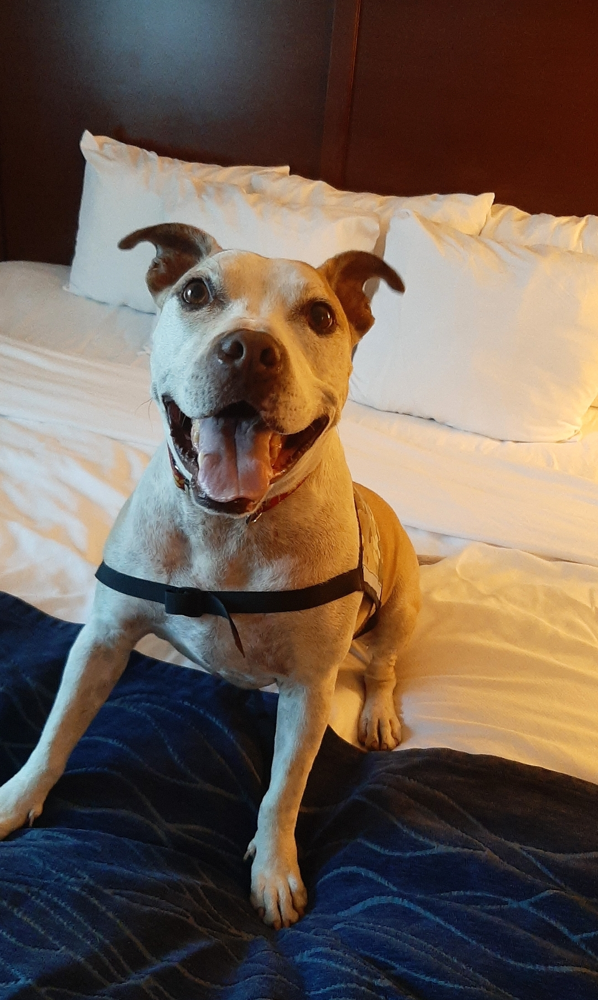

# Introduction

This is where I will introduce the work I have been doing as an graduate research assistant for *Apartheid Heritage(s)*. Of course, I will need to introduce *my* trusty research assistant, Byrone "Buster" Bluth.

Primarily, I will discuss my role in rethinking and creating annotations for a digital humanities project that examines contested spacial history by exploring specific places in a 3D model.

I will include block quotes to emphasize the methodology of the work and the many conversations I have had with Dr. Nieves.

>Block quote that shows off the research that has been done. So much research will be exemplified here and readers will be *impressed*.
